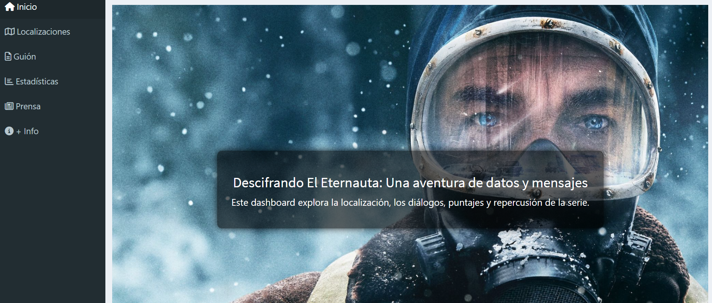

# El Eternauta 📺❄️

**Tablero interactivo en Shiny** sobre la serie de Netflix *"El Eternauta"*, basado en la historieta original de Oesterheld y Solano López. 
[Enlacen al tablero](https://nataliamarinn.shinyapps.io/eternauta/)

Este proyecto analiza la narrativa, localizaciones, recepción crítica y cobertura mediática de la serie utilizando técnicas de minería de texto, visualización geográfica y puntaje de la serie.

## 🔍 ¿Qué hace este tablero?

La aplicación permite:

- 📍 Visualizar en un mapa las localizaciones reales mencionadas o recreadas en la serie.
- 🗣️ Analizar el guión mediante subtítulos, destacando palabras clave y relaciones semánticas.
- ⭐ Consultar estadísticas de cada episodio: puntaje IMDb, fecha de estreno, reseñas.
- 📰 Comparar el enfoque de distintos medios de comunicación mediante análisis TF-IDF.

---

## 🧪 Tecnologías utilizadas

- **R** y **Shiny** para la interfaz interactiva.
- **Leaflet** para el mapa.
- **tidyverse** y **tidytext** para el análisis de texto.
- **plotly** y **ggraph** para visualizaciones.
- **readxl** y **tidygeocoder** para lectura de archivos e integración de coordenadas.
